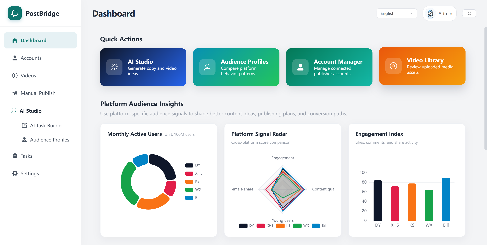

# PostBridge

[中文说明](README.zh-CN.md)


> A local-first social media publishing and AI content operations workspace.

PostBridge is built for creators, social media operators, and small teams who want one local control panel for platform accounts, video assets, AI-assisted content creation, manual publishing, batch publishing, and scheduled tasks.



## ✨ What It Does

PostBridge puts content production and multi-platform publishing into one workflow:

- Manage accounts for Douyin, Kuaishou, Xiaohongshu, WeChat Channels, Bilibili, and related platforms.
- Maintain a local video asset library with upload, preview, rename, and delete actions.
- Publish selected videos manually, in batches, or on a schedule.
- Generate topics, titles, descriptions, tags, and video prompts with AI.
- Connect video generation providers and continue AI creation tasks through to publishing.
- Track AI creation tasks and publishing tasks from one task center.

## 🚀 Highlights

- **Local-first data**: account profiles, cookies, databases, logs, and video assets stay on your machine by default.
- **Unified operations console**: accounts, assets, publishing, tasks, settings, and AI creation live in the same interface.
- **Multi-platform publishing flow**: browser automation connects PostBridge to mainstream content platforms.
- **AI-assisted creation**: platform persona templates, prompt generation, video generation tasks, and task continuation are built in.
- **Desktop packaging support**: the frontend and backend can be bundled into a Windows desktop application.

## 👥 Who It Is For

- Creators managing multiple social media accounts.
- Operators who need a shared place for video assets, publishing plans, and account status.
- Small teams that want to add AI topic, copywriting, and video generation workflows to publishing.
- Developers exploring local RPA publishing, AI content workflows, and desktop app packaging.

## ⚡ Quick Start

Start the backend:

```bash
cd postbridge_backend
python -m venv .venv
source .venv/bin/activate
pip install -r requirements.txt
playwright install chromium
python app.py
```

On Windows PowerShell, activate the virtual environment with:

```powershell
.\.venv\Scripts\Activate.ps1
```

Start the frontend:

```bash
cd postbridge_frontend
npm install
npm run dev
```

Open:

```text
http://localhost:5173
```

The backend runs at `http://localhost:5409` by default, and the frontend development server proxies API requests to it.

## 🧭 Usage Flow

1. Configure the Chrome path and any AI or video generation providers in Settings.
2. Add platform accounts and complete login or cookie validation.
3. Upload video assets or create AI-assisted content tasks.
4. Choose the platform, account, title, description, tags, and publishing time.
5. Run manual publishing, batch publishing, or scheduled publishing.
6. Monitor task status, progress, and errors from the Tasks page.

## 📚 Documentation

- Frontend: [postbridge_frontend/README.md](postbridge_frontend/README.md)
- Backend: [postbridge_backend/README.md](postbridge_backend/README.md)

## 🗂️ Repository Overview

```text
.
|-- picture/               Screenshots and README images
|-- postbridge_frontend/   Frontend dashboard
|-- postbridge_backend/    Backend API, RPA services, and AI services
|-- build_exe.bat          Windows packaging script
|-- build_exe.sh           Unix-like packaging script
|-- README.md              English project README
`-- README.zh-CN.md        Chinese project README
```

## 🖥️ Desktop Build

On Windows, run:

```bat
build_exe.bat
```

The script builds the frontend, copies static assets, installs backend packaging dependencies, and generates a desktop application with PyInstaller.

The output is usually:

```text
postbridge_backend\dist\PostBridge.exe
```

## 🔐 Data And Security

PostBridge stores runtime data locally, including account profiles, cookies, browser profiles, uploaded videos, generated media, SQLite databases, logs, and service credentials. Before publishing the repository, make sure this data has not been committed.

Check these paths and files carefully:

- `data/`
- `database/*.db`
- `logs/`
- `node_modules/`
- `dist/`
- virtual environment folders
- API keys or account credentials

## 🛠️ Project Status

This project is still evolving around local content operations, AI creation, and multi-platform publishing automation. Platform page structures and login flows may change, so publishing automation requires ongoing maintenance.

## 📄 License

This project is licensed under the GNU General Public License v3.0.
