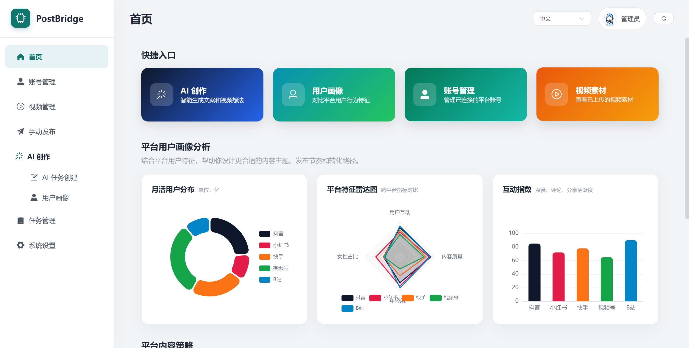

# PostBridge

[English](README.md)


> 本地优先的社交媒体内容发布与 AI 创作运营工作台。

PostBridge 面向内容创作者、矩阵号运营和中小团队，提供一个可以在本地运行的统一控制台，用来管理平台账号、视频素材、AI 内容生成、手动发布、批量发布和定时任务。



## ✨ 这个项目能做什么

PostBridge 把“内容生产”和“多平台发布”放在同一个工作流里：

- 管理抖音、快手、小红书、视频号、Bilibili 等平台账号。
- 维护本地视频素材库，支持上传、预览、重命名和删除。
- 选择账号和素材后进行手动发布、批量发布或定时发布。
- 通过 AI 生成选题、标题、描述、标签和视频提示词。
- 接入视频生成服务后，串联 AI 创作、视频生成和发布任务。
- 在任务页统一查看 AI 创作任务和发布任务进度。

## 🚀 项目亮点

- **本地优先**：账号资料、Cookie、数据库、日志和视频素材默认保存在本机。
- **一站式运营台**：账号、素材、发布、任务、设置和 AI 创作都在同一个界面完成。
- **多平台发布流程**：通过浏览器自动化衔接主流内容平台的发布入口。
- **AI 创作辅助**：支持平台人设模板、提示词生成、视频生成任务和任务续跑。
- **桌面打包友好**：支持将前端和后端打包成 Windows 桌面程序。

## 👥 适合谁使用

- 需要同时维护多个平台账号的内容创作者。
- 希望把视频素材、发布计划和账号状态集中管理的运营人员。
- 想把 AI 选题、文案和视频生成接入日常发布流程的小团队。
- 想研究本地化 RPA 发布、AI 内容工作流和桌面打包方案的开发者。

## ⚡ 快速开始

启动后端：

```bash
cd postbridge_backend
python -m venv .venv
source .venv/bin/activate
pip install -r requirements.txt
playwright install chromium
python app.py
```

Windows PowerShell 激活虚拟环境：

```powershell
.\.venv\Scripts\Activate.ps1
```

启动前端：

```bash
cd postbridge_frontend
npm install
npm run dev
```

打开：

```text
http://localhost:5173
```

后端默认运行在 `http://localhost:5409`，前端开发服务会自动代理接口请求。

## 🧭 使用流程

1. 在设置页配置 Chrome 路径，以及需要使用的 AI 或视频生成服务。
2. 添加平台账号，完成登录或 Cookie 校验。
3. 上传视频素材，或通过 AI 创作页面生成内容任务。
4. 选择平台、账号、标题、描述、标签和发布时间。
5. 执行手动发布、批量发布或定时发布。
6. 在任务页查看任务状态、进度和错误信息。

## 📚 项目文档

- 前端说明：[postbridge_frontend/README.md](postbridge_frontend/README.md)
- 后端说明：[postbridge_backend/README.md](postbridge_backend/README.md)

## 🗂️ 目录概览

```text
.
|-- picture/               项目截图和 README 图片
|-- postbridge_frontend/   前端控制台
|-- postbridge_backend/    后端 API、RPA 服务和 AI 服务
|-- build_exe.bat          Windows 打包脚本
|-- build_exe.sh           类 Unix 系统打包脚本
`-- README.md              项目介绍
```

## 🖥️ 打包为桌面程序

Windows 下可以直接运行：

```bat
build_exe.bat
```

脚本会构建前端、复制静态资源、安装后端打包依赖，并通过 PyInstaller 生成桌面程序。

输出位置通常为：

```text
postbridge_backend\dist\PostBridge.exe
```

## 🔐 数据与安全

PostBridge 会在本地保存运行数据，包括账号资料、Cookie、浏览器 Profile、上传视频、生成媒体、SQLite 数据库、日志和服务凭据。公开仓库前请确认这些数据没有被提交。

建议重点检查：

- `data/`
- `database/*.db`
- `logs/`
- `node_modules/`
- `dist/`
- 虚拟环境目录
- 各类 API Key 或账号凭据

## 🛠️ 项目状态

该项目仍在迭代中，核心能力围绕本地内容运营、AI 创作和多平台发布自动化展开。不同平台的页面结构和登录策略可能变化，发布自动化能力需要持续维护。

## 📄 License

本项目使用 GNU General Public License v3.0 开源许可证。
